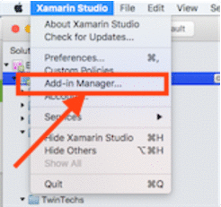

# Twin Tools Addin for Xamarin Studio

## Overview

At [Twin Tecnologies](https://www.twintechs.com/) we pride ourselves on craftsmanship and efficiency. We think Xamarin Studio is great; but there are a few gaps in the navigation/tooling which stops us from being as productive as when we use JetBrains IDEA/ReSharper.

As such, I've been putting together features into a personal add-in over the past year, which we're now making available to the community as an open source project. You can view the source and raise bugs/pull requests [here](https://github.com/georgejecook/TwinToolsForXamarin)

## Installation

  1. Open add-in manager
  2. Select Gallery, click Manage repositories
  3. Enter url http://www.tantawowa.com/twintools/repo/
  4. Select repository "All repositories" from the gallery, select Twin Tools and and click install.
  
  

## Features
The addin provides the following features:

  * List class members via hotkey (ordered by document location, works in XAML too)
  * Filter and jump straight to a class member
  * Hotkey for previous/next member (also works in XAML)
  * Filterable recent file history (only search for documents you're actively working on)
  * Toggle XAML/Code-behind/ViewModel files
  * Automatically fix namespace to match current folder location (plus experimental refactoring to update all references)
  * Go To Definition+, an improved goto definition implementation that can:
    * Go to actual member implementations, if the cursor is on an interface type
    * Cycle between multiple classes, if there are multiple implementors of an interface member
    * Go to a method/property on your view model from a XAML file
    * Go to an event handler in your code behind file, from a XAML file
  * Toggle class/unit test file, and go to correct method in each
  * Generate unit test for current method in implementation file
  
Please check the default hotkeys and be prepared to reconfigure, as they are currently to my preference and may not be to yours.

## Overview

You will find an overview video here : [https://www.youtube.com/watch?v=_sYSDFR0H5Q](https://www.youtube.com/watch?v=_sYSDFR0H5Q), to help get you started.

## A note on naming conventions

### Toggling ViewModel/XAML

  * If your XAML file is called `View.xaml` then the View model _must_ be named `ViewVM.cs` or `ViewViewModel.cs`
  * The files can all be in the same folder, or you can have the xaml in a `View` folder, and the VM's in a `ViewModel` folder
  
### Go to unit test

  * If your project is called `MyProject` then your test project must be called `MyProjectTests`
  * Your unit test project must be in the implementation project's solution
  * It is expected that your unit test project uses the same namespacing as your implementation project.
  * If a method is named `SomeMethod` then your tests must be called `TestSomeMethod` or `Test_SomeMethod`
  * You can have multiple methods, and add more stuff to the end of the name e.g. `Test_SomeMethod_InvalidEntryScenarios`
  * Generated methods are named `Test_MethodName`
  
## WIP features

### Fix namespace

  * The feature is currently experimental
  * It is not yet implemented as a hot-fix
  * It will update the namespace to the _correct_ namespace for the files location in the source code folder. You cannot change the namespace arbitrarily
  * Refactoring other files is experimental. You'd be best served to commit your work before trying. Don't worry, it will ask you if you want to do that before it goes doing crazy stuff
  * this feature is WIP
  
### Xamarin Studio 6.0 (roslyn) support

This work has been started, and will be complete when Xamarin Studio 6.0 goes to beta.
